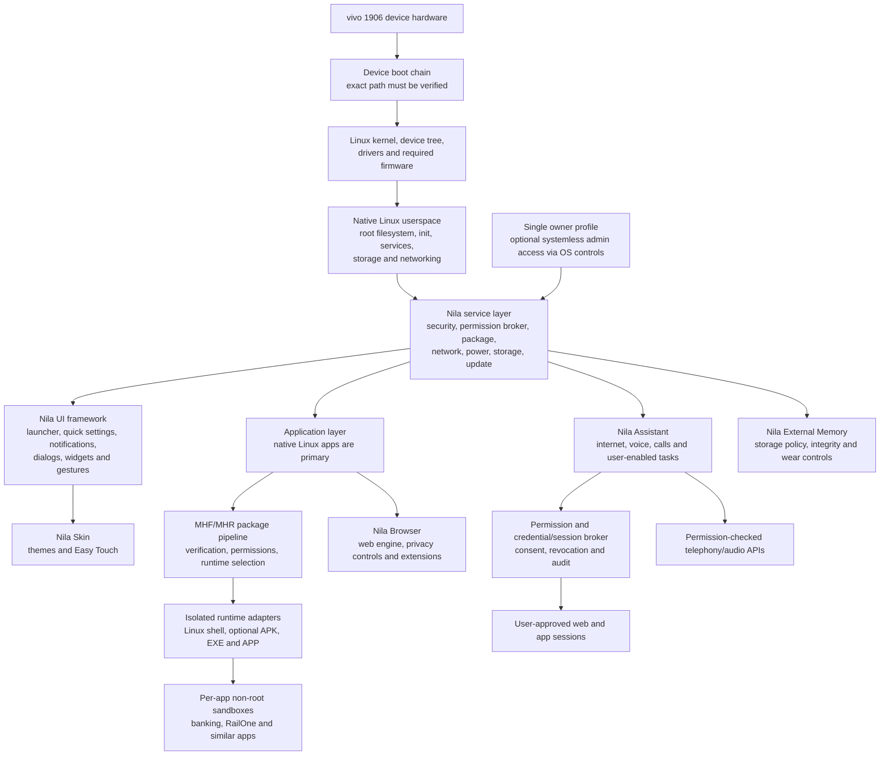

# Nila OS target architecture

## Project identity

Nila OS is intended to be a Linux-based mobile operating system. Its base is a Linux kernel with Nila's native Linux userspace. It is not Android or an AOSP distribution.

The vivo 1906 profile records the phone's factory firmware as a device reference. That information helps identify the hardware, boot chain, firmware, and available driver sources; it does not make Android the Nila OS base.

## Target architecture

The diagram describes the intended product. Labels below are goals; the current repository does not contain a bootable system.

## Device and Linux layers

1. **Device boot and kernel.** Use a verified source tree, exact device configuration, device tree/overlays, boot path, modules, and required firmware for the supported vivo 1906 variant. The current repository has a guarded helper for an externally supplied kernel tree; it does not supply or validate that tree.
2. **Native Linux userspace.** Build a device root filesystem, early userspace, init/service manager, logging, networking, storage, and update services. Do not use Android init as Nila's system init.
3. **Nila services.** Provide permission-checked interfaces for security, accounts, packages, storage, memory, network, power, updates, telephony, and recovery. A service registry alone does not launch or secure services.
4. **Nila UI framework and Skin.** Run a native launcher and system UI in Nila's Linux graphical session. The framework should provide quick settings, notifications, dialogs, widgets, and gestures. Nila Skin is the default theme. Theme packs must be optional and accurately attributed; do not call a third-party theme official without confirming ownership and permission.
5. **Applications.** Native Linux applications are the primary target. MHF packages should carry a strict manifest, resources, permissions, payload integrity, and signatures. Runtime dispatch must happen only after package verification and user consent.

## Application formats and isolation

MHR currently recognizes extensions; recognition does not imply a working runtime. The intended compatibility targets are:

- **.sh:** execute only through a restricted Linux environment with an explicit permission profile.
- **.apk:** optional Android application compatibility runtime, isolated from the Linux base.
- **.exe:** optional Windows compatibility runtime; arbitrary binaries must not run just because the extension matches.
- **.app:** define the package meaning before implementation. The current code treats it as an Apple application; it must not be presented as a Nila-native format until the project chooses and documents that format.

Every app must have its own unprivileged identity and sandbox, with explicit storage, network, device, and capability grants. Banking, RailOne, and similar apps must remain in separate non-root sandboxes. Compatibility with each app and its provider's integrity checks must be tested; the project cannot promise every banking app will accept a custom Linux system.

## User account, root, and security

Nila is intended for one interactive owner profile. System services and app processes still need separate identities. Optional systemless administrator access must be user-controlled, mediated by an OS privilege service, and unavailable to applications and the Assistant by default.

The target security stack includes verified boot where the device boot chain supports it, enforced Linux security policy (including SELinux or an equivalent selected policy), capabilities, per-app isolation, signed packages, integrity verification, and audited privileged operations. The current Rust policy checks do not enforce any of these kernel or service boundaries.

## Nila Assistant

Nila Assistant is intended to be a more capable, internet-connected, voice-first assistant. When the user enables access, it may search online, operate selected apps and account sessions, handle calls, and use approved voice/audio features.

Users must be able to enable, review, and revoke access by app, account, and capability. Sign-in and account sessions must use an OS credential/session broker and isolated app or browser contexts. Stored passwords and authentication secrets must not be exposed to the assistant model or general logs. Financial, security, and other consequential actions require an explicit confirmation at the point of action.

The Assistant remains unprivileged and uses permission-checked APIs. It cannot obtain root or bypass app sandboxes. Access to a banking or RailOne app is opt-in and remains subject to that app's non-root isolation.

## Nila Browser

Nila Browser is a planned native application. The design reference calls for a Chromium-based engine, web privacy controls, optional extension support, and separate VPN/Tor controls. Engine selection, extension compatibility, network isolation, and privacy behavior must be evaluated before these are described as supported. Browser sign-in sessions must remain isolated and must not expose stored credentials to the Assistant.

## Storage and external memory

Nila External Memory is intended to offer user-controlled storage choices such as off, phone storage, SD card, automatic selection, and custom selection. It needs explicit mount permissions, integrity checks, safe removal, encryption policy, and wear limits.

zRAM and storage-backed swap are candidate memory-management features, not current capabilities. Storage-backed swap must remain optional until performance, encryption, privacy, and flash-wear behavior are measured on the target device.

## Installer, recovery, and updates

A graphical installer, PC/USB-assisted installation, signed system updates, compatibility checks, backup, recovery, and rollback are planned. These depend on a verified device boot path and a tested restore mechanism. No installer or OTA service may claim success until it validates the exact target and can recover safely from interruption.

## Current implementation boundary

The repository currently contains Rust engineering tools and metadata, not these complete system layers. It has MHR extension recognition and hashing, MHF manifest metadata, MFR signature and payload checks that fail closed when runtimes are absent, policy/service-list validation, a device profile validator, and a guarded kernel-build helper.

Nila Skin and Easy Touch exist as a browser preview. Their controls do not operate Linux system services. There is no bootable Linux distribution, native shell, browser, assistant runtime, app runtime, enforcing sandbox, installer, external-memory service, device image, or phone boot test in this repository. Do not infer an implementation from a name in a registry, mockup, or runtime label.
